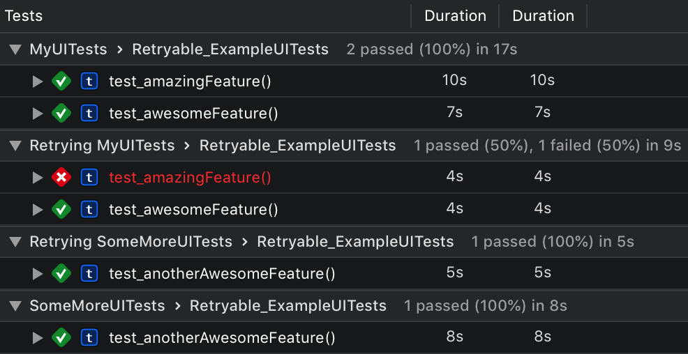

# Retryable

[](https://travis-ci.org/kanecheshire/Retryable)
[](https://cocoapods.org/pods/Retryable)
[](https://cocoapods.org/pods/Retryable)
[](https://cocoapods.org/pods/Retryable)

`Retryable` is a small library for being able to make your iOS UI/automation tests retry when a flaky test fails.

## Benefits

Unlike some other options for making your automation tests re-run when a failure occurs, `Retryable` will **only re-run the individual test functions that failed**, rather than running the entire suite again which can be incredibly time consuming.

Cruicially, `Retryable` expects you to mark **specific portions of a test** as flaky, so that any other failure during the test function is not automatically retried and will **fail normally**.

In addition to the above, `Retryable` also works great with parallel automation tests and also adds retried tests to a JSON file in the `xcresult` bundle so that you can track flakes and retries on CI.

## Opting into retries

To opt into retries you only need to do two things:

1: Make your test cases subclass the `RetryableTestCase` instead of `XCTestCase`:

```swift
import Retryable

class MyUITests: RetryableTestCase {

}
```
2: Mark the portion of your test case that sometimes fails as flaky:

```swift
import Retryable

class MyUITests: RetryableTestCase {

    func test_awesomeFeature() {
        // ... Your automation code you're always expecting to work ...

        flaky(.notFixable(reason: "UserDefaults doesn't always save properly on the iOS 11 simulator")) {
            // ... Your automation code that sometimes fails because UserDefaults is unreliable
        }

        // ... Some more of your automation code you're always expecting to work ...
    }

}
```

Note how part of the function is marked as flaky, and when marking as flaky you are required to determine whether it's a fixable flake or not.

Regardless of whether you think it's fixable, you're also required to provide a reason.

These two requirements help prevent bad habits of marking everything as flaky without properly investigating it, and helps document what's wrong for future developers on your codebase.

## Detecting retries on CI

It can be important to know when a test has been retried so that you can track flakiness. Retryable helps with this by creating a JSON file containing all the tests that were retried, which you can look for and parse as part of your CI process.

This is the structure of the JSON file which is called `retryable-retries.json`:

```
{
  "retries": [
    {
      "name": "-[MyUITests test_awesomeFeature]",
      "fixable": false,
      "reason": "UserDefaults doesn't always save properly on the iOS 11 simulator"
    },
    {
      "name": "-[SomeMoreUITests test_anotherAwesomeFeature]",
      "fixable": true,
      "reason": "We've got a race condition here"
    }
  ]
}
```
> NOTE: xcresult bundles are auto-generated by Xcode in Derived Data, it's up to you how you grab that info out of it as part of your CI process!

Once you've detected and parsed that file, you could, for example, send a Slack message to indicate that tests have passed but the above tests had to be retried.

An example of how you could parse this using Fastlane/Ruby could be something like this:

```ruby
lane :tests do |options|
  scan
  path_to_derived_data = lane_context[:SCAN_DERIVED_DATA_PATH]
  path_to_json = Dir["#{path_to_derived_data}/**/*.xcresult/retryable-retries.json"].last
  if path_to_json != nil
    file = File.open(path_to_json, 'rb')
    retries = JSON.parse(file.read)
    file.close
    count_of_retried_tests = retries["retries"].count
    # Do something with the count of failures that were retried, like send a Slack message
  end
end
```

## Under the hood

The way `Retryable` works is not immediately obvious and takes a little bit of understanding of how `XCTestCase`s are run.

For **every test function** you write and want to run, `XCTest` creates a **new instance** of the `XCTestCase` that defined the functions. That means you can have multiple instances of your test case, **one for each function**. `XCTest` initializes each `XCTestCase` with a `Selector` for the actual function it wants to run.

`Retryable` does the same thing, detecting failures and then recreating an `XCTestCase` with the same selector to re-run the test. To be able to re-run the tests, a few key things have to happen:

- Firstly, `Retryable` needs to detect a failure by intercepting calls to record a failure in the `XCTestCase` itself. When a failure is detected, `Retryable` checks whether the state is currently set to `flaky`.
- If it's not currently `flaky` the failure is recorded as normal, but if it is then the `XCTestCase` is allowed to record the failure but the `XCTestCaseRun` that is running the `XCTestCase` is instructed to ignore the failure. This step is important because the `XCTestCase` needs to fail so that the test doesn't continue to run, but the `XCTestCaseRun` needs to ignore the failure so it doesn't mark the whole test run as a failure.
- Finally, `Retryable` observes the ending of `XCTestSuite`s and then re-runs the failed tests it detected in a new `XCTestSuite`.

> Note: In addition to detecting if a failure occurred because of a flake, Retryable also checks if the test function has been retried a maximum number of times. By default this is a maximum of 1 times.

## Good to know

Since `Retryable` intercepts calls to record failures, tests that fail while marked as flaky and that are queued for a retry will show as passing. This is a bit confusing but unavoidable, since allowing the flake to be marked as a failure by `XCTest` would fail the whole run, making the re-running of flakes pointless.



## Installation

Retryable is currently available through Cocoapods. When Xcode 11 is released Retryable will only be available through Swift Package Manager.

## Author

[kane.codes](http://kane.codes), [@kanecheshire](https://twitter.com/kanecheshire)

## License

Retryable is available under the MIT license. See the LICENSE file for more info.
